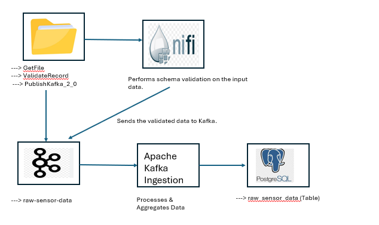

# Real-Time Data Pipeline: Occupancy Dataset

This project demonstrates a real-time data pipeline for processing the **Occupancy dataset**, using Apache NiFi, Apache Kafka, Python, and PostgreSQL. It automates the ingestion, validation, and storage of sensor data, making it scalable and fault-tolerant.

---

## **Architecture**

### **Components**
1. **Input Data (CSV Files)**:
   - Sensor data files are placed in a monitored folder.

2. **Apache NiFi**:
   - **GetFile**: Watches the folder for new files.
   - **ValidateRecord**: Validates the data structure and schema.
   - **PublishKafka_2_0**: Sends valid records to Apache Kafka.

3. **Apache Kafka**:
   - Stores raw and processed data in topics:
     - `raw-sensor-data`
     - `processed-sensor-data`

4. **Ingestion Script**:
   - Reads data from Kafka.
   - Processes and aggregates metrics (e.g., average temperature, occupancy rate).
   - Writes data to PostgreSQL.

5. **PostgreSQL Database**:
   - Stores:
     - Raw data: `raw_sensor_data`
     - Processed data: `processed_sensor_data`
    
     

---
SensorDataPipeline/
├── Data/
├── Database/
├── Ingestion/
├── Monitor/
├── docs/
├── nifi/
├── README.md
├── requirements.txt

### **Folder Details**

| **Folder/File**         | **Description**                                                                                 |
|--------------------------|-------------------------------------------------------------------------------------------------|
| [Data](./Data/)          | Contains raw CSV files for the pipeline to process.                                            |
| [Database](./Database/)  | SQL scripts for setting up the PostgreSQL database schema and tables.                          |
| [Ingestion](./Ingestion/)| Python scripts to ingest and process data from Kafka to PostgreSQL.                            |
| [Monitor](./Monitor/)    | Python scripts to monitor the folder and send data to Kafka.                                   |
| [docs](./docs/)          | Contains the architecture diagram and additional documentation.                                |
| [nifi](./nifi/)          | Apache NiFi templates for automating data flow.                                                |
| [README.md](./README.md) | This file, which provides instructions for running and scaling the project.                    |
| [requirements.txt](./requirements.txt)| Python dependencies for running the scripts.                                     |

---

---

## **How to Run the Pipeline**

### **1. Clone the Repository**

Clone the repository and navigate to the project directory:

git clone https://github.com/anjaliparihar97/SensorDataPipeline.git
cd SensorDataPipeline

## **Features**
 - Real-time data processing from input files.
- Validation of data using NiFi.
- Scalable message transport with Kafka.
- Aggregated metrics and raw data storage in PostgreSQL.

---

## **Prerequisites**
- **Python** 3.8+
- **Apache NiFi**
- **Apache Kafka**
- **PostgreSQL**

---

## **Setup Instructions**

### ** 2. Install Dependencies **

Install the required Python libraries:

pip install -r requirements.txt

### **3. Set Up PostgreSQL **

Run the setup script to create the database and tables:

psql -U postgres -f database/postgres_setup.sql

### **4. Set Up and Start Kafka **

Start Kafka and create the required topics:

bash setup/kafka_setup.sh

### **5. Start NiFi **

Start Apache NiFi and import the pipeline template:

bash setup/nifi_setup.sh

    Access NiFi at http://localhost:8080/nifi.
    Import the nifi_template.xml file from the nifi/ folder.
    Update the GetFile Processor to monitor the data/ folder.

### **6. Run the Monitor Script **

The Monitor script observes the data/ folder for new CSV files and sends them to Kafka.

python monitor/monitor.py

### **7. Run the Ingestion Script **

The Ingestion script reads data from Kafka, processes it, and stores it in PostgreSQL:

python ingestion/ingestion.py

## **Testing the Pipeline **
### **Step 1: Add Sample Files **

Place CSV files in the data/ folder. Example file:

timestamp,temperature,humidity,light,CO2,occupancy
2023-11-22 10:00:00,22.5,60,120,400,1
2023-11-22 10:05:00,23.0,58,110,420,0

### **Step 2: Monitor the Pipeline **

    NiFi UI: Check file ingestion and validation progress.
    Kafka Logs: Verify that data is being sent to the raw-sensor-data topic.
    PostgreSQL:
        Query the raw_sensor_data table for raw data:

SELECT * FROM raw_sensor_data;

Query the processed_sensor_data table for aggregated metrics:

        SELECT * FROM processed_sensor_data;

Scaling Instructions

    Handling More Datasets:
        Add validation schemas in NiFi for new datasets.
        Create separate Kafka topics for different datasets.

    Scaling for High Volume:
        Increase Kafka partitions for parallel processing.
        Use PostgreSQL table partitioning for time-series data.

        Scaling Instructions
1. Horizontal Scaling for Large Volumes

To handle millions of files or sensor data entries per day:

    Distributed Processing:
        Use Apache Kafka to partition messages across multiple brokers for high throughput.
        Introduce Apache Spark or Apache Flink for distributed, parallel data processing.
    Cloud-Native Services:
        Leverage AWS Lambda, Google Cloud Functions, or Azure Functions for serverless processing.
        Use Google Cloud Pub/Sub or AWS SQS for asynchronous, scalable message handling.
    Data Lake Integration:
        Store raw data in a data lake (e.g., Amazon S3, Google Cloud Storage) for long-term storage and batch analytics.

2. Optimizations for High-Volume Data Ingestion

    Batch Processing:
        Process data in batches instead of row-by-row for database and message efficiency.
    Backpressure Handling:
        Configure NiFi queues and Kafka consumers to handle surges in incoming data gracefully.
    Data Compression:
        Use compression (e.g., Gzip, LZ4) to minimize network bandwidth and storage costs.

3. Database Scaling

    Sharding:
        Distribute the database horizontally by splitting data across multiple nodes (e.g., by sensor ID or location).
    Read Replicas:
        Use PostgreSQL read replicas to distribute query load across multiple instances.
    Partitioning:
        Partition tables by date or sensor type for faster queries and efficient data storage.

4. Fault Tolerance

    Retry Mechanisms:
        Implement retries for transient failures (e.g., database connection issues).
    Dead-Letter Queues:
        Route invalid or unprocessable data to a Kafka dead-letter queue or NiFi quarantine folder.
    Failover Clusters:
        Use high-availability clusters for Kafka, NiFi, and PostgreSQL to prevent single points of failure.

